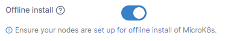

# Offline installation

To perform a MicroK8s environment creation when the target servers are offline or airgapped, some prerequisite configuration is required. This includes downloading the MicroK8s installation files for the version you wish to install, the related addon images, and the Portainer Agent image.


This is advanced functionality and assumes working knowledge of the Linux command line. If you do not explicitly need to perform offline or airgapped installs of MicroK8s environments we recommend following the [standard procedure](./).


## Preparation

As with a standard MicroK8s provision, Portainer requires SSH access to the servers that are being provisioned. Within this SSH user's home directory, create a directory named `microk8s`, and within that a subdirectory named `images`. This is where Portainer expects the MicroK8s files to be for an offline installation. For example:

```
mkdir -p $HOME/microk8s
mkdir -p $HOME/microk8s/images
```

Once you have completed the below steps, ensure that the above directory (and files within) are owned by the SSH user that Portainer will connect with to perform the installation.

You will also want to ensure you have `snap` installed as this is required for the MicroK8s installation. Modern versions of Ubuntu should come with `snap` preinstalled, but you can refer to the [snap documentation](https://snapcraft.io/docs/installing-snap-on-ubuntu) if you need to install it separately.

## Download MicroK8s

Next you will need to download the MicroK8s installation files. The below example does so for version 1.27 - if you need to use a different version, adjust the command accordingly.

```
snap download microk8s --channel 1.27
snap download core20
```

This should result in 4 files being downloaded - an `.assert` file and a `.snap` file for both `microk8s` and `core20`. For example (your exact filenames may differ):

```
core20_2318.assert
core20_2318.snap
microk8s_6743.assert
microk8s_6743.snap
```

Move these downloaded files into the `microk8s` directory you created earlier, renaming them as you go to the filenames expected by Portainer:

```
mv microk8s_*.snap $HOME/microk8s/microk8s.snap
mv microk8s_*.assert $HOME/microk8s/microk8s.assert
mv core20_*.snap $HOME/microk8s/core20.snap
mv core20_*.assert $HOME/microk8s/core20.assert
```

## Download required images

To support the necessary addons for MicroK8s, you will need to pre-download the Docker images used to provision the addons. The exact addons and versions differ depending on the version of MicroK8s you are installing, and can be found at the following URL in the MicroK8s repository (adjust the version number to suit):

```
https://github.com/canonical/microk8s/blob/1.27/build-scripts/images.txt
```

For example, for 1.27 you will need the following:

```
docker.io/calico/cni:v3.25.0
docker.io/calico/kube-controllers:v3.25.0
docker.io/calico/node:v3.25.0
docker.io/cdkbot/hostpath-provisioner:1.4.2
docker.io/coredns/coredns:1.10.0
docker.io/library/busybox:1.28.4
registry.k8s.io/ingress-nginx/controller:v1.5.1
registry.k8s.io/metrics-server/metrics-server:v0.5.2
registry.k8s.io/pause:3.7
```

In addition, you will need the Portainer Agent image - replace `{PORTAINER_SERVER_VERSION}` with the version number that matches your Portainer Server installation (for example, `2.20.3`):

```
docker.io/portainer/agent:{PORTAINER_SERVER_VERSION}
```

You may also want to pre-download the `kubectl-shell` image if you wish to use the [kubectl shell](../../../../../using-portainer/kubernetes/kubectl.md) functionality within Portainer:

```
docker.io/portainer/kubectl-shell:latest
```

One way to pre-download these images is to use an installed version of Docker to pull the images and then save them in the path and filename that is expected. For example:

```
docker image pull docker.io/portainer/agent:2.20.3
docker image save docker.io/portainer/agent:2.20.3 -o "$HOME/microk8s/images/docker,io-portainer-agent_2.20.3.tar"
```

This will need to be done for each image needed. A simple bash script, once populated with the images in a list, could perform this:

```
imageList=("docker.io/calico/cni:v3.25.0" "docker.io/calico/kube-controllers:v3.25.0" "docker.io/calico/node:v3.25.0" "docker.io/cdkbot/hostpath-provisioner:1.4.2" "docker.io/coredns/coredns:1.10.0" "docker.io/library/busybox:1.28.4" "registry.k8s.io/ingress-nginx/controller:v1.5.1" "registry.k8s.io/metrics-server/metrics-server:v0.5.2" "registry.k8s.io/pause:3.7" "docker.io/portainer/agent:2.20.3" "docker.io/portainer/kubectl-shell:latest")

for image in ${imageList[@]}; do
  docker image pull $image && docker image save $image -o "$HOME/microk8s/images/$(echo $image | sed 's/\//-/g' | sed 's/:/_/g').tar"
done
```

## Copy the files to all nodes

If you are installing a multi-node cluster, the `$HOME/microk8s` directory and files within must be on all nodes in the cluster at the same path. While doing this, ensure that the directory and files have the correct owner (the SSH user that Portainer will use to connect to the nodes).

## Begin the installation

You are now ready to follow the [standard procedure](./) in Portainer for creating a MicroK8s cluster, but with the **Offline install** toggle enabled.

<figure><figcaption></figcaption></figure>
